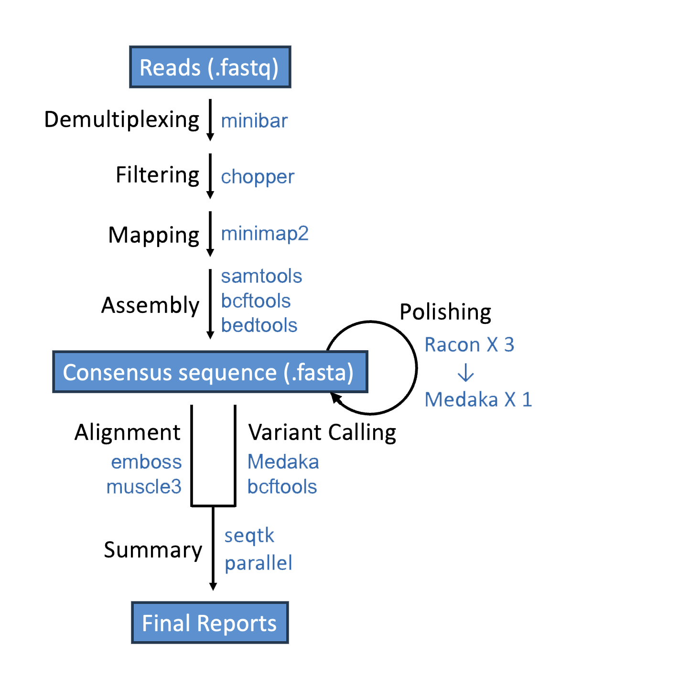
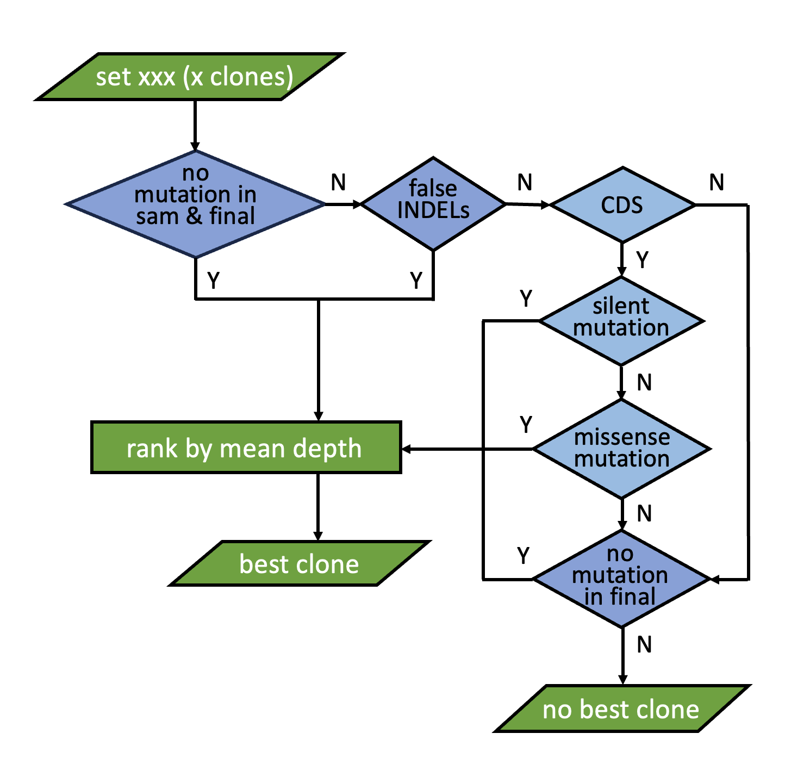

# Construct Validation for IGGYPOPseq
We established a pipeline that performs comprehensive analysis and generates a consensus sequence for constructs created using [IGGYPOPseq](https://github.com/cutlersr/iggypop) (indexed golden gate gene assembly from PCR’d oligonucleotide pools). The pipeline also provides detailed summaries at each step of the process.

## Table Of Content

- [Pipeline Overview](#pipeline-overview)
    - [Consensus Sequence Generation](#consensus-sequence-generation)
    - [Best Clone Selection](#best-clone-selection)
- [Getting Started](#getting-started)
    - [Requirements](#requirements)
    - [Input](#input)
    - [Execution](#execution)
    - [Output](#output)
    - [Help](#help)
- [License & DOI](#license-&-doi)
- [Citation](#citation)
- [References](#references)

## Pipeline Overview

### Consensus Sequence Generation
The flowchart illustrating the pipeline is shown below.  
  
In general, this pipeline uses `miniBar` for demultiplexing with an optimized combination of the maximum allowed edit distance for both barcodes and primers (Krehenwinkel et al., 2019). `Chopper` is applied to remove low-quality reads (De Coster and Rademakers, 2023). The filtered reads are mapped to the reference sequence using `minimap2`, and the draft consensus sequence for each sample is assembled with `samtools`, `bcftools`, and `bedtools` (Quinlan and Hall, 2010; Li, 2018; Danecek et al., 2021). The draft assembly is polished through three rounds of `Racon`, followed by one round of `Medaka`. After generating the final consensus sequences for all the samples, variant calling is conducted by `Medaka`, and results are extracted by `seqtk`. If the sequence is solely the coding sequence, the type of mutations is determined with the application of `emboss` (Rice et al., 2000). The pairwise alignment between the consensus sequence and the reference is visualized as individual HTML files, generated by `muscle3` (Edgar, 2004). Statistics for each step are obtained by `samtools`, `deeptools` (Ramírez et al., 2016), `emboss`, and `parallel` (Tange O, 2021). All the results generated from each step are stored in the Excel file named "Summary.xlsx", under the sheet titled "All Info".
  
[(Back to top)](#construct-validation-for-iggypopseq)

### Best Clone Selection
The selection process for the best clone of each construct is outlined in the flowchart below:
  
Briefly, during the analysis procedure, you may found heterogeneous sites after the draft assembly by `samtools`, 
The results are recorded in the "Summary_by_gene" sheet within the "Summary.xlsx" file. Additionally, all clones associated with unsuccessful constructs are documented in the "Sets_incorrect" sheet of the same file.
  
[(Back to top)](#construct-validation-for-iggypopseq)

## Getting Started

To run the shell script properly, please ensure that you provide the input files with the correct format and contains the requried information. We have included a demo input files as an example, which you can download for reference. The detailed tutorial for interpreting the results got from the demo dataset is available [here](./Tutorial.pdf). 

### Requirements

The required software and version are listed below.  
  
| Software | Version |
|----------|---------|
| [minibar](https://github.com/calacademy-research/minibar) | 0.25 |
| [chopper](https://github.com/wdecoster/chopper)  | 0.8.0 | 
| [minimap2](https://github.com/lh3/minimap2) | 2.24 |
| [samtools](https://github.com/samtools/samtools) | 1.19.2 |
| [bcftools](https://github.com/samtools/bcftools) | 1.19 |
| [bedtools](https://github.com/arq5x/bedtools2) | 2.30.0 |
| [Racon](https://github.com/isovic/racon) | 1.5.0 |
| [Medaka](https://github.com/nanoporetech/medaka) | 1.6 |
| [seqtk](https://github.com/lh3/seqtk) | 1.4 |
| [emboss](http://emboss.open-bio.org/) | 6.6.0 |
| [muscle3](https://www.drive5.com/muscle/) | 3.8.31 |
| [parallel](https://www.gnu.org/software/parallel/sphinx.html) | 20220122 |
| [deeptools](https://github.com/deeptools/deepTools) | 3.5.1 |
  

### Input

The input directory for this pipeline should have the following files with the exact file names and should be organized as follows:

``` 
├── Input
│   ├── SampleInfo.tsv
│   └── passed_all.fastq
```
  
The `SampleInfo.tsv` file should have the following columns. An example file is available [here](./demo/Input/SampleInfo.tsv).  
  
| Parameter name  | Type | Description |
|-----------------|------|-------------|
| primer_index | string | Primer index for the construct, must be unique for each construct. |
| SampleID | string | Sample ID for the samples, usually a combination of the primer index and the replicate number. |
| n_frags | integer | Number of fragments. |
| CDS_length | integer | Optional, the length of CDS (coding sequence) if the reference sequence is CDS and the user want to detect missense/silent mutation. |
| Reference | string | Name of the reference. |
| ReferenceSequence | string | Sequence of the reference. |
| Fwindex | string | Sequence of forward barcode. |
| FwPrimer | string | Sequence of forward primer. |
| Rvindex | string | Sequence of reverse barcode. |
| RvPrimer | string | Sequence of reverse primer. |
  

### Execution

#### Run shell script on HPCC environment

  1. Clone or download the pipeline from the GitHub.  
  
  You can either [clone the repository](https://docs.github.com/en/repositories/creating-and-managing-repositories/cloning-a-repository) using git or download it as a ZIP file. Ensure that the following files are present within their respective folders after downloading.

``` 
.
├── Scripts
│   ├── InputFiles.R
│   └── Summary.R
│   └── Report.Rmd
│   └── minibar.py
│   └── Construct_Validation_per_sample.sh
│   └── Demultiplexing_e_E.sh
│   └── Summary.sh
└── ConstructValidation.sh
```

  2. Execute the pipeline using the following command line: 
  
```
./ConstructValidation.sh --script <DIR> -i <DIR> -o <DIR>
```

The available options for the shell script are listed below.
  
    Usage:
    ./ConstructValidation.sh --script <DIR> -i <DIR> -o <DIR> [options]
    Options:
      --script                      <DIR>   Scripts directory
      -i, --input                   <DIR>   Input directory
      -o, --output                  <DIR>   Output directory
      -q_chopper                    <INT>   Sets a minimum average Phred quality score for reads filtered by Chopper (default:10)
      -e                            <INT>   Barcode edit distance value (default:4, only if optimizing_eE is false)
      -E                            <INT>   Primer edit distance value (default:11, only if optimizing_eE is false)
      --medaka_model                <STR>   Base-calling model used for Medaka polishing (default:r941_min_hac_g507)
      --optimizing_eE                       Use the built-in function to optimize demultiplexing parameters (e & E) for maximum mapped reads
      --amino_acid_seq_validation           Translate the first ORF to its amino acid sequence to detect missense/silent mutations
      -h, --help                            Display this help
    

### Output

The results of the pipeline will be stored in a folder named "Analysis_Results" in your output directory and structured as follows:

```
(i)                     (ii)                 (iii)
input_reads.fastq   ─── input_directory  ─── input_directory
                        ├── reads0.fastq     ├── barcode01
                        └── reads1.fastq     │   ├── reads0.fastq
                                             │   └── reads1.fastq
                                             ├── barcode02
                                             │   ├── reads0.fastq
                                             │   ├── reads1.fastq
                                             │   └── reads2.fastq
                                             └── barcode03
                                              └── reads0.fastq
```

Output files may be aggregated including information for all samples or provided per sample. Per-sample files will be prefixed with respective aliases and represented below as {{ alias }}.

| Title | File path | Description | Per sample or aggregated |
|-------|-----------|-------------|--------------------------|
| workflow report | ./wf-amplicon-report.html | Report for all samples. | aggregated |
| Sanitized reference file | ./reference_sanitized_seqIDs.fasta | Some programs used by the workflow don't like special characters (like colons) in the sequence IDs in the reference FASTA file. The reference is thus "sanitized" by replacing these characters with underscores. This file is only generated when the workflow is run in variant calling mode. | aggregated |
| Sanitized reference index file | ./reference_sanitized_seqIDs.fasta.fai | FAI index for the sanitised reference FASTA file. | aggregated |
| Alignments BAM file | ./{{ alias }}/alignments/{{ alias }}.aligned.sorted.bam | BAM file with alignments of input reads against the references (in variant calling mode) or the created consensus (in de-novo consensus mode). | per-sample |
| Alignments index file | ./{{ alias }}/alignments/{{ alias }}.aligned.sorted.bam.bai | Index for alignments BAM file. | per-sample |
| De-novo consensus FASTQ file | ./{{ alias }}/consensus/consensus.fastq | Consensus sequence file generated by de-novo consensus pipeline. | per-sample |
| Consensus FASTA file | ./{{ alias }}/consensus/medaka.consensus.fasta | Consensus sequence file generated by variant calling pipeline. | per-sample |
| Variants VCF file | ./{{ alias }}/variants/medaka.annotated.vcf.gz | VCF file of variants detected against the provided reference. | per-sample |
| Variants index file | ./{{ alias }}/variants/medaka.annotated.vcf.gz.csi | Index for variants VCF file. | per-sample |
| Combined de-novo consensus sequences | ./all-consensus-seqs.fasta | FASTA file containing all de-novo consensus sequences. | aggregated |
| Combined de-novo consensus sequences index | ./all-consensus-seqs.fasta.fai | FAI index for the FASTA file with the combined de-novo consensus sequences. | aggregated |
| IGV config JSON file | ./igv.json | JSON file with IGV config options to be used by the EPI2ME Desktop Application. | aggregated |
  
[(Back to top)](#construct-validation-for-iggypopseq)

### Help

If you need any help or support related to this app, feel free to contact us at zxing001@ucr.edu, and the issues can also be reported on https://github.com/ZenanXing/Construct-Validation-for-IGGYPOPseq/issues.  
  
[(Back to top)](#construct-validation-for-iggypopseq)

## License & DOI

This project is licensed under the GNU General Public License, version 3 (GPLv3) - see the LICENSE.md file for details, and the DOI for the pipeline is [](https://doi.org/10.5281/zenodo.14681407).  
  
[(Back to top)](#construct-validation-for-iggypopseq)

## Citation

*Xing Z, Eckhardt J, Vaidya A, Cutler S. BioCurve Analyzer: a web-based shiny app for analyzing biological response curves. (manuscript in preparation)*  

## References

*Danecek P, Bonfield JK, Liddle J, Marshall J, Ohan V, Pollard MO, Whitwham A, Keane T, McCarthy SA, Davies RM, et al (2021) Twelve years of SAMtools and BCFtools. Gigascience. doi: 10.1093/gigascience/giab008*  
*De Coster W, Rademakers R (2023) NanoPack2: population-scale evaluation of long-read sequencing data. Bioinformatics 39: btad311*  
*Edgar RC (2004) MUSCLE: multiple sequence alignment with high accuracy and high throughput. Nucleic Acids Res 32: 1792–1797*  
*Krehenwinkel H, Pomerantz A, Henderson JB, Kennedy SR, Lim JY, Swamy V, Shoobridge JD, Graham N, Patel NH, Gillespie RG, et al (2019) Nanopore sequencing of long ribosomal DNA amplicons enables portable and simple biodiversity assessments with high phylogenetic resolution across broad taxonomic scale. Gigascience 8: giz006*  
*Li H (2018) Minimap2: pairwise alignment for nucleotide sequences. Bioinformatics 34: 3094–3100*  
*Quinlan AR, Hall IM (2010) BEDTools: a flexible suite of utilities for comparing genomic features. Bioinformatics 26: 841–842*  
*Ramírez F, Ryan DP, Grüning B, Bhardwaj V, Kilpert F, Richter AS, Heyne S, Dündar F, Manke T (2016) deepTools2: a next generation web server for deep-sequencing data analysis. Nucleic Acids Res 44: W160–5*  
*Rice P, Longden I, Bleasby A (2000) EMBOSS: The European molecular biology open software suite. Trends Genet 16: 276–277*  
*Tange O (2021) GNU Parallel 20220122 ('20 years’). doi: 10.5281/zenodo.5893336*  

[(Back to top)](#construct-validation-for-iggypopseq)
