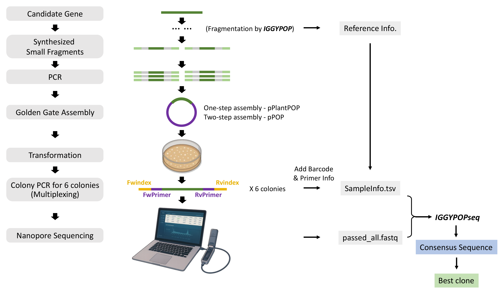

# Construct Validation for IGGYPOP
We established a pipeline that performs comprehensive analysis for Nanopore sequencing data, designed to generate and validate the consensus sequences for constructs created using [IGGYPOP](https://github.com/cutlersr/iggypop) (indexed golden gate gene assembly from PCR amplified oligonucleotide pools). The pipeline identifies the best clone for each construct and provides detailed summaries at every step of the process.  

## Table of Content

- [Pipeline Overview](#pipeline-overview)
    - [Consensus Sequence Generation](#consensus-sequence-generation)
    - [Best Clone Selection](#best-clone-selection)
- [Getting Started](#getting-started)
    - [Requirements](#requirements)
    - [Input](#input)
    - [Execution](#execution)
        - [Linux](#--linux)
        - [Docker](#--docker)
        - [Parallelized analyses with SLURM](#--parallelized-analyses-with-slurm)
    - [Output](#output)
    - [Help](#help)
- [License & DOI](#license-&-doi)
- [Citation](#citation)
- [References](#references)

## Pipeline Overview

  
In the complete pipeline, the input sequences (e.g., candidate genes) will first be properly fragmented and modified by [IGGYPOP](https://github.com/cutlersr/iggypop). Subsequently, the fragments will be synthesized, amplified, and reassembled into vectors, either pPlantPOP or pPOP for our research. After transformation, six colonies will be selected, then the target sequence can be amplified and multiplexed using the designed barcoded primers. A list of these primers and their suggested combinations can be found [here](./Input/PrimerAssignment). You may use them to add the primer and barcode(index) information and create the one of the input files - "SampleInfo.tsv". To assist in generating this file, we developed a Shiny app called [Tidy-Buddy](https://github.com/ZenanXing/Tidy-Buddy.git). The amplicons will then be pooled and sequenced using the MinION Flow Cell (Oxford Nanopore Technologies). The resulting FASTQ file, along with the "SampleInfo.tsv", will be utilized as input files in the IGGYPOPseq analysis, which will facilitate the generation of a consensus sequence for each clone, and then the selection of the best clone according to the following workflow.  

### Consensus Sequence Generation
The flowchart illustrating the pipeline is shown below.  
  
In general, this pipeline uses `miniBar` for demultiplexing with an optimized combination of the maximum allowed edit distance for both barcodes and primers (Krehenwinkel et al., 2019). `Chopper` is applied to remove low-quality reads (De Coster and Rademakers, 2023). The filtered reads are mapped to the reference sequence using `minimap2`, and the draft consensus sequence for each sample is assembled with `samtools`, `bcftools`, and `bedtools` (Quinlan and Hall, 2010; Li, 2018; Danecek et al., 2021). The draft assembly is polished through three rounds of `Racon`, followed by one round of `Medaka`. After generating the final consensus sequences for all the samples, variant calling is conducted by `Medaka`, and results are extracted by `seqtk`. If the sequence is solely the coding sequence, the type of mutations is determined with the application of `emboss` (Rice et al., 2000). The pairwise alignment between the consensus sequence and the reference is visualized as individual HTML files, generated by `muscle3` (Edgar, 2004). Statistics for each step are obtained by `samtools`, `deeptools` (Ramírez et al., 2016), `emboss`, and `parallel` (Tange O, 2021). All the results generated from each step are stored in the Excel file named "Summary.xlsx", under the sheet titled "All Info".
  
[(Back to top)](#construct-validation-for-iggypop)

### Best Clone Selection
The selection process for the best clone of each construct is outlined in the flowchart below.
  
During the analysis process, a draft consensus sequence is initially generated using `samtools`. This draft sequence is then polished using `Racon` and `Medaka`, producing the final consensus sequence. Based on our prior experience, some constructs may exhibit heterozygous sites that are detectable by `samtools`, which represent as lowercase letters (possible gap) or ambiguity codes (possible SNPs) in the draft sequence. However, this information is typically lost during the polishing steps, and it is not retained in the final sequence.  
As part of our pipeline, we first prioritize and select constructs that have no mutations in both the draft sequence (generated by `samtools`) and the final sequence (after polishing). It has been reported that polynucleotides (e.g. polyA or polyT) can lead to false indels (insertions and deletions) in the consensus sequence. From our observations, such indels are all false negatives. Therefore, if no better constructs are available in the first selection step, we prioritize those annotated as having false indels. In cases where the reference sequences are CDS (coding sequences), constructs containing silent mutations or missense mutations will then be preferred as the best clones. After that, if there is still no better option, the clones with no mutations in the final polished sequence will be provided. However, clones annotated with potential heterozygous sites should be used with caution.  
The results of the analysis are recorded in the "Summary_by_gene" sheet within the "Summary.xlsx" file. Additionally, all clones associated with unsuccessful constructs are documented in the "Sets_incorrect" sheet of the same file.  
  
[(Back to top)](#construct-validation-for-iggypop)

## Getting Started

To run the shell script properly, please ensure that you provide the input files with the correct format and contains the requried information. We have included a [demo](./Input/demo) input files as an example, which you can download for reference. 

### Requirements

The required software and R packages (R version 4.4.2), along with their respective versions, are listed below.  
  
| Software                                                                 | Version |    | R Package                                                               | Version |
|--------------------------------------------------------------------------|---------|----|---------------------------------------------------------------------------|---------|
| [minibar](https://github.com/calacademy-research/minibar)              | 0.25    |    | [tidyverse](https://github.com/tidyverse/tidyverse)                     | 2.0.0   |
| [chopper](https://github.com/wdecoster/chopper)                        | 0.8.0   |    | [biostrings](https://github.com/Bioconductor/Biostrings)                | 2.74.0  |
| [minimap2](https://github.com/lh3/minimap2)                           | 2.24    |    | [openxlsx](https://github.com/awalker89/openxlsx)                       | 4.2.7.1 |
| [samtools](https://github.com/samtools/samtools)                       | 1.19.2  |    | [seqinr](https://github.com/lbbe-software/seqinr)                       | 4.2-36  |
| [bcftools](https://github.com/samtools/bcftools)                       | 1.19    |    | [stringr](https://github.com/tidyverse/stringr)                         | 1.5.1   |
| [bedtools](https://github.com/arq5x/bedtools2)                         | 2.30.0  |    | [purrr](https://github.com/tidyverse/purrr)                             | 1.0.2   |
| [Racon](https://github.com/lbcb-sci/racon)                             | 1.5.0   |    | [cowplot](https://github.com/wilkelab/cowplot)                          | 1.1.3   |
| [Medaka](https://github.com/nanoporetech/medaka)                       | 2.0.1   |    | [rmarkdown](https://github.com/rstudio/rmarkdown)                        | 2.29    |
| [seqtk](https://github.com/lh3/seqtk)                                  | 1.4     |    |                                                                          |
| [emboss](https://github.com/kimrutherford/EMBOSS)                      | 6.6.0   |    |                                                                          |
| [muscle3](https://www.drive5.com/muscle/)                              | 3.8.31  |    |                                                                          |
| [parallel](https://www.gnu.org/software/parallel/sphinx.html)           | 20220122 |   |                                                                          |
  

### Input

The input directory for this pipeline should have the following files with the exact file names and should be organized as follows.

``` 
Input
├── SampleInfo.tsv
└── passed_all.fastq
```
  
The `SampleInfo.tsv` file should have the following columns. An example file is available [here](./Input/demo/SampleInfo.tsv).  
  
| Parameter name  | Type | Description |
|-----------------|------|-------------|
| primer_index | string | Primer index for the construct. Must be unique for each construct. |
| SampleID | string | Sample ID for the samples, usually a combination of the primer index and the replicate number. Must be unique for each sample. |
| n_frags | int | Number of fragments. |
| CDS_length | int | Optional, the length of CDS (coding sequence) if the reference sequence is CDS and the user want to detect missense/silent mutation. |
| Reference | string | Name of the reference. |
| ReferenceSequence | string | Sequence of the reference. |
| Fwindex | string | Sequence of forward barcode. |
| FwPrimer | string | Sequence of forward primer. |
| Rvindex | string | Sequence of reverse barcode. |
| RvPrimer | string | Sequence of reverse primer. |
  

### Execution

You can run the pipeline on Linux or through a Docker image. Additionally, we provide scripts for performing the analysis on cluster with SLURM.  

### - Linux

  1. Download the required [scripts](./Scripts) from the GitHub. Ensure that the following files are present after downloading.

``` 
├── scripts
│   ├── InputFiles.R
│   ├── Summary.R
│   ├── Report.Rmd
│   ├── minibar.py
│   ├── Construct_Validation_per_sample.sh
│   ├── Demultiplexing_e_E.sh
│   └── Summary.sh
├── setup.sh
├── Install_R_Packages.R
└── ConstructValidation.sh
```

  2. Ensure the required [software and R packages](#requirements) are properly installed. A [shell](./Scripts/setup.sh) script is provided for installation.  
  
  3. Execute the pipeline using the following command line: 
  
```
# Make the scripts executable
chmod +x ./setup.sh ./ConstructValidation.sh

# Create a virtual environment before running the setup script  
python3 -m venv /opt/venv  

# Set the virtual environment as the default python environment  
PATH="/opt/venv/bin:$PATH"  

# Run the setup.sh script to install required software and packages
./setup.sh

# Run the script
./ConstructValidation.sh --script <DIR> -i <DIR> -o <DIR> [options]

```

The available options for the shell script are listed below.
  
    Usage:
    ./ConstructValidation.sh --script <DIR> -i <DIR> -o <DIR> [options]
    Options:
      --script                      <DIR>   Scripts directory
      -i, --input                   <DIR>   Input directory
      -o, --output                  <DIR>   Output directory
      -q_chopper                    <INT>   Sets a minimum average Phred quality score for reads filtered by Chopper (default:13)
      -e                            <INT>   Barcode edit distance value (default:8, only if optimizing_eE is false)
      -E                            <INT>   Primer edit distance value (default:11, only if optimizing_eE is false)
      --medaka_model                <STR>   Base-calling model used for Medaka polishing (default:r1041_e82_400bps_hac_v4.3.0)
      --optimizing_eE                       Use the built-in function to optimize demultiplexing parameters (e & E) for maximum mapped reads
      --amino_acid_seq_validation           Translate the first ORF to its amino acid sequence to detect missense/silent mutations
      -h, --help                            Display this help

The default values of the `q_chopper`, `e`, `E` and `medaka_model` are optimized for our specific experiments and primer/barcode sets. However, you may adjust these parameters as needed to suit your own experimental setup.  
  
[(Back to top)](#construct-validation-for-iggypop)

    
### - Docker

  1. Download the required [scripts](./Scripts) from the GitHub. Ensure that the following files are present after downloading.

``` 
├── scripts
│   ├── InputFiles.R
│   ├── Summary.R
│   ├── Report.Rmd
│   ├── minibar.py
│   ├── Construct_Validation_per_sample.sh
│   ├── Demultiplexing_e_E.sh
│   └── Summary.sh
├── Dockerfile
├── setup.sh
├── Install_R_Packages.R
└── ConstructValidation.sh
```
  2. Execute the pipeline within the folder using the following command line: 
  
```
## Step 1: Change to the "Scripts" directory
cd Scripts

## Step 2: Build the Docker image named "iggypopseq"
# This process may take ~ one hour. Please be patient while it completes.
docker build --platform linux/amd64 -t iggypopseq .

## Step 3: Start an interactive Docker container  
# 1. Replace <name_of_your_analysis> with your chosen container name (e.g., iggypop_test).  
# 2. Mount your input and output directories from your computer to the container:  
#    - Replace <Input_DIR> with the path to the folder containing your input sequences.  
#    - Replace <Output_DIR> with the path to the folder where output will be stored.  
# Note: Ensure that both the Input and Output folders exist on your computer before running this command.  
docker run -it \
  --platform linux/amd64 \
  --name <name_of_your_analysis> \
  -v <Input_DIR>:/app/input \
  -v <Output_DIR>:/app/output \
  iggypopseq
e.g. Command line to analyze the demo data:
docker run -it \
  --platform linux/amd64 \
  --name demo \
  -v ./Input/demo:/app/input \
  -v ./Output:/app/output \
  iggypopseq

## Step 4: Within the bash shell, run the ConstructValidation.sh script  
# Execute the script with the following command, replacing [options] as needed:
./ConstructValidation.sh --script /app/scripts -i /app/input -o /app/output [options]
e.g. Command line to analyze the demo data:
./ConstructValidation.sh --script /app/scripts -i /app/input -o /app/output \
  -q_chopper 13 \
  --optimizing_eE \
  --amino_acid_seq_validation
  
```

The available options for the shell script are listed below.
  
    Usage:
    ./ConstructValidation.sh --script <DIR> -i <DIR> -o <DIR> [options]
    Options:
      --script                      <DIR>   Scripts directory
      -i, --input                   <DIR>   Input directory
      -o, --output                  <DIR>   Output directory
      -q_chopper                    <INT>   Sets a minimum average Phred quality score for reads filtered by Chopper (default:13)
      -e                            <INT>   Barcode edit distance value (default:8, only if optimizing_eE is false)
      -E                            <INT>   Primer edit distance value (default:11, only if optimizing_eE is false)
      --medaka_model                <STR>   Base-calling model used for Medaka polishing (default:r1041_e82_400bps_hac_v4.3.0)
      --optimizing_eE                       Use the built-in function to optimize demultiplexing parameters (e & E) for maximum mapped reads
      --amino_acid_seq_validation           Translate the first ORF to its amino acid sequence to detect missense/silent mutations
      -h, --help                            Display this help

The default values of the `q_chopper`, `e`, `E` and `medaka_model` are optimized for our specific experiments and primer/barcode sets. However, you may adjust these parameters as needed to suit your own experimental setup.  


[(Back to top)](#construct-validation-for-iggypop)

### - Parallelized analyses with SLURM
  
   The following scripts allow for parallel analysis of all samples on cluster with SLURM.

  1. Download the required [scripts](./Parallelized_Analyses) from the GitHub. Ensure that the following files are present within their respective folders after downloading.  

``` 
├── Scripts
│   ├── InputFiles.R
│   ├── Summary.R
│   ├── Report.Rmd
│   ├── minibar.py
│   ├── Construct_Validation_per_sample.sh
│   ├── Demultiplexing_e_E.sh
│   └── Summary.sh
└── ConstructValidation.sh
```

  2. Ensure the required [software and R packages](#requirements) are properly installed on cluster. Some packages may need to be installed via Conda. For example, most software is available on our cluster (HPCC, High-Performance Computing Center), but chopper should be installed separately using the following command: `conda create -n chopper_env -c conda-forge -c bioconda chopper`.  
  You may also need to adjust the shell script to properly load the software on your cluster. In the shell script provided, the software is loaded by `module load <software>`, as Module Environment is available on our cluster.  

  3. Execute the pipeline using the following command line: 
  
```
./ConstructValidation.sh --script <DIR> -i <DIR> -o <DIR> [options]
```

The available options for the shell script are listed below.
  
    Usage:
    ./ConstructValidation.sh --script <DIR> -i <DIR> -o <DIR> [options]
    Options:
      --script                      <DIR>   Scripts directory
      -i, --input                   <DIR>   Input directory
      -o, --output                  <DIR>   Output directory
      -q_chopper                    <INT>   Sets a minimum average Phred quality score for reads filtered by Chopper (default:13)
      -e                            <INT>   Barcode edit distance value (default:8, only if optimizing_eE is false)
      -E                            <INT>   Primer edit distance value (default:11, only if optimizing_eE is false)
      --medaka_model                <STR>   Base-calling model used for Medaka polishing (default:r1041_e82_400bps_hac_v4.3.0)
      --optimizing_eE                       Use the built-in function to optimize demultiplexing parameters (e & E) for maximum mapped reads
      --amino_acid_seq_validation           Translate the first ORF to its amino acid sequence to detect missense/silent mutations
      -h, --help                            Display this help

The default values of the `q_chopper`, `e`, `E` and `medaka_model` are optimized for our specific experiments and primer/barcode sets. However, you may adjust these parameters as needed to suit your own experimental setup.  
  
[(Back to top)](#construct-validation-for-iggypop)


### Output

The final results will be presented as an [Excel file](./Output/demo/OutputFiles/Summary.xlsx) and an accompanying [HTML report](./Output/demo/OutputFiles/Report.html). The most informative columns in the first two sheets of the Excel file are explained below. Descriptions of the columns in the "All_Info" sheet and the results of all steps from the pipeline can be found in the [here](./Output_Descriptions.md).   

| Column Name | Type | Description |
|-------|------|-------------|
| primer_index | string | Primer index for the construct. |
| Status | string | Indicates if obtaining a valid clone for the construct was "Successful" or "Failed". |
| clone_to_keep | string | The best clone chosen by the pipeline. |
| Reference | string | Name of the reference. |
| n_frag | int | Number of fragments. |
| ref_DNA_Length | int | Length of the reference sequence. |
| Reads_sorted_after_Demultiplexing | int | Reads assigned to the sample after demultiplexing. |
| Reads_Mapped | int | Reads mapped to the reference sequence for the sample. |
| Mean_Depth | float | Mean sequencing depth of the sample. |
| Attention_LowDepth | bool | Indicates if the sample has low sequencing depth. |
| Attention_PossibleHetSites | bool | Indicates if the sample has possible heterozygous sites. |
| CheckINDEL | bool | Indicates if the sample have the false INDELs. |
| missenseMutation_medaka_1rd | bool | Indicates if the sample has missense mutation (only valid when the input sequence is CDS). |
| aaMutation_medaka_1rd | bool | Indicates if the sample retains the same amino acid sequence (only valid when the input sequence is CDS). |
| Alignment_{*} | link | Hyperlinks to the pairwise alignments of the assembled sequences generated by samtools and medaka polishing against the reference sequence. |
| Alignment_{*}_all_steps | link | Hyperlinks to the pairwise alignments of the assembled sequences generated at all steps against the reference sequence. |
| Alignment_{*}_all_clones | link | Hyperlinks to the pairwise alignments of the assembled sequences generated in the end (after medaka polishing) of all clones against the reference sequence. |
| ConsensusSequence | string | Consensus sequence generated in the final step. |
| ReferenceSequence | string | Sequence of the reference. |  


[(Back to top)](#construct-validation-for-iggypop)

### Help

If you need any help or support related to this pipeline, feel free to contact us at zxing001@ucr.edu, and the issues can also be reported on https://github.com/ZenanXing/Construct-Validation-for-IGGYPOPseq/issues.  
  
[(Back to top)](#construct-validation-for-iggypop)

## License & DOI

This project is licensed under the GNU General Public License, version 3 (GPLv3) - see the LICENSE.md file for details, and the DOI for the pipeline is [](https://doi.org/10.5281/zenodo.15176482).  
  
[(Back to top)](#construct-validation-for-iggypop)

## Citation

*Dvir G, Xing Z, Beldman I, Rivera A, Wheeldon I, Cutler SR. Synthesis of large single-transcript pathways from oligonucleotide pools: design of STARBURST, an autobioluminescent reporter (manuscript in preparation)*  

## References

*Danecek P, Bonfield JK, Liddle J, Marshall J, Ohan V, Pollard MO, Whitwham A, Keane T, McCarthy SA, Davies RM, et al (2021) [Twelve years of SAMtools and BCFtools](https://academic.oup.com/gigascience/article/10/2/giab008/6137722). Gigascience. doi: 10.1093/gigascience/giab008*  
*De Coster W, Rademakers R (2023) [NanoPack2: population-scale evaluation of long-read sequencing data](https://academic.oup.com/bioinformatics/article/39/5/btad311/7160911). Bioinformatics 39: btad311*  
*Edgar RC (2004) [MUSCLE: multiple sequence alignment with high accuracy and high throughput](https://academic.oup.com/nar/article/32/5/1792/2380623). Nucleic Acids Res 32: 1792–1797*  
*Krehenwinkel H, Pomerantz A, Henderson JB, Kennedy SR, Lim JY, Swamy V, Shoobridge JD, Graham N, Patel NH, Gillespie RG, et al (2019) [Nanopore sequencing of long ribosomal DNA amplicons enables portable and simple biodiversity assessments with high phylogenetic resolution across broad taxonomic scale](https://academic.oup.com/gigascience/article/8/5/giz006/5368330). Gigascience 8: giz006*  
*Li H (2018) [Minimap2: pairwise alignment for nucleotide sequences](https://academic.oup.com/bioinformatics/article/34/18/3094/4994778). Bioinformatics 34: 3094–3100*  
*Quinlan AR, Hall IM (2010) [BEDTools: a flexible suite of utilities for comparing genomic features](https://academic.oup.com/bioinformatics/article/26/6/841/244688). Bioinformatics 26: 841–842*  
*Ramírez F, Ryan DP, Grüning B, Bhardwaj V, Kilpert F, Richter AS, Heyne S, Dündar F, Manke T (2016) [deepTools2: a next generation web server for deep-sequencing data analysis](https://academic.oup.com/nar/article/44/W1/W160/2499308). Nucleic Acids Res 44: W160–5*  
*Rice P, Longden I, Bleasby A (2000) [EMBOSS: The European molecular biology open software suite](https://www.sciencedirect.com/science/article/pii/S0168952500020242?via%3Dihub). Trends Genet 16: 276–277*  
*Tange O (2021) GNU Parallel 20220122 ('20 years’). doi: 10.5281/zenodo.5893336*  

[(Back to top)](#construct-validation-for-iggypop)
